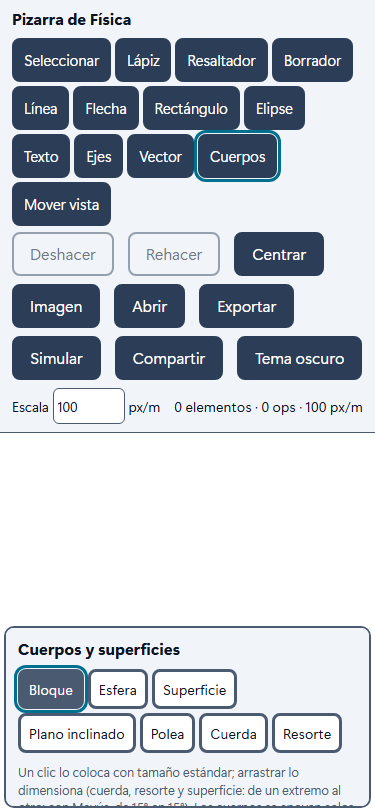
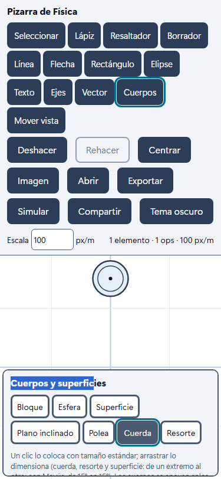
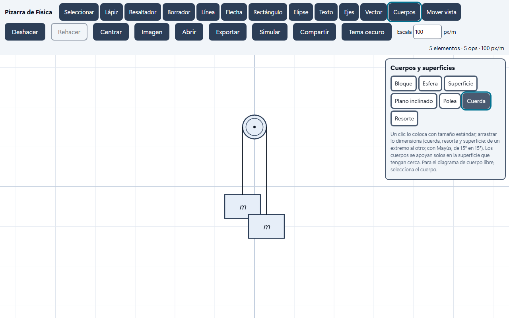
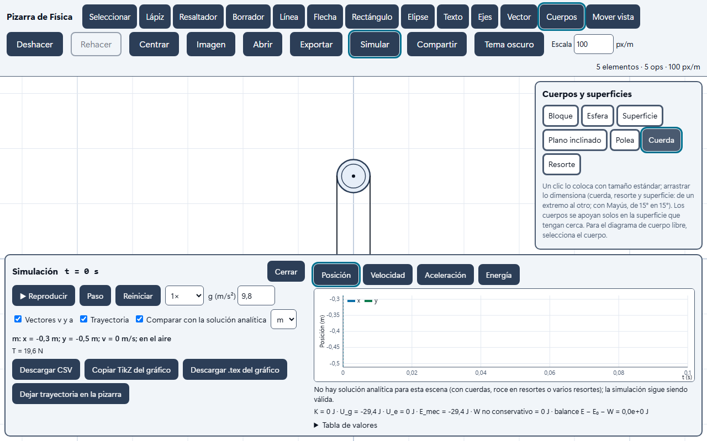

# Auditoría Nivel 2 — Fase 0

**Fecha:** 2026-10-05 · **Alcance:** lectura del código y de la documentación, prueba de uso con la interfaz real y
sondas sobre el motor. **No se modificó código.** Lo único agregado son este informe y cuatro capturas
(`docs/capturas/auditoria-n2-*.png`).

---

## 0. Resumen

1. **La base es sólida y se conserva.** El registro de ops, el compartir en vivo, la exportación, los temas y el motor
   RK4 + Lagrange están bien hechos y probados. Línea base: **298 pruebas unitarias y 42 e2e en verde** (las 9 de
   captura se omiten si no se activa `CAPTURAS=1`), sin errores de tipos ni de lint.
2. **El problema de fondo es el que describes, y lo confirmé con evidencia.** Las uniones se deducen por cercanía.
   Con **1 cm más de error** (10 cm en vez de 9 cm), un Atwood deja de funcionar y los dos bloques caen libres. Si
   se agrega la cuerda que cuelga la polea del techo, el Atwood se rompe en silencio. Dos poleas, la polea móvil y
   los bloques apilados dan resultados físicamente falsos **sin ningún aviso** (§4).
3. **En el celular, hoy no se puede armar un Atwood.** En 375 × 812 la barra de herramientas ocupa **541 px de 812**
   y la paleta de cuerpos tapa otros 180 px. Queda una franja útil de unos 85 px de alto (§3.1).
4. **El motor no escala.** El costo crece con el cubo del número de cuerpos (sistema denso):
   **20 cuerpos ya no corren en tiempo real en un PC de escritorio y 50 van 15 veces más lento que el tiempo real**
   (§4.3). La meta de 50 objetos a 60 fps exige cambiar el solucionador, aunque se conserve el motor.
5. **Propuesta:** el modelo pasa a ser **un grafo explícito**: elementos con **puertos**, cuerdas y resortes con
   **extremos anclados** y una **ruta** por poleas, y cuerpos con un **apoyo** explícito sobre su superficie. La geometría
   de las uniones se **deriva** de ese grafo y la simulación y el DCL lo leen **con el mismo lector**. Los proyectos v1
   se migran con las reglas de cercanía de hoy, congeladas en una función con prueba (§7).
6. **Motor:** recomiendo **mantener y extender el motor propio** (sistema reducido, cuerpos que giran, contactos entre
   cuerpos, poleas con inercia, rodadura) y **medir Planck.js en un experimento acotado** antes de descartarlo (§8).
   La decisión final queda en un ADR con los números.

**Decisiones que necesito de ti:** al final, en §11 (son 5, cortas).

---

## 1. Cómo se hizo

| Qué | Cómo |
|---|---|
| Lectura | `PROMPT_MAESTRO.md`, `README.md`, `docs/*.md`, los 7 ADR, `CHANGELOG.md` y todo `src/` (≈ 13 400 líneas con pruebas). |
| Línea base | `vitest run` (298/298), `playwright test` (42 en verde y 9 capturas omitidas), `tsc --noEmit` y `eslint` limpios. |
| Prueba de uso | Script de Playwright que usa **la interfaz real** (clics y arrastres, no proyectos cargados por código) en **375 × 812** y **1280 × 800**: armar un Atwood con la paleta *Cuerpos*. |
| Sondas del motor | 15 escenas armadas por código sobre `construirModelo` + `Simulacion`, comparadas con la teoría (Atwood con distintas punterías, plano + polea, dos poleas, polea móvil, bloques apilados, costo según el número de cuerpos). |

Las sondas y los scripts quedaron fuera del repositorio (eran de una sola vez). Si los quieres como pruebas de
regresión, en la Fase 1 los convierto en pruebas de verdad.

**Dato llamativo:** las pruebas e2e de simulación **cargan la escena por código** («más práctico que dibujarla»,
`tests/e2e/simulacion.spec.ts`). Ninguna prueba arma un montaje con la interfaz, así que la fricción de uso nunca se midió.

---

## 2. Qué está bien y se conserva

- **Registro de ops append-only** con deshacer y rehacer como meta-ops (`core/ops.ts`, `core/store.ts`). Es la base
  correcta para guardar, transmitir y reproducir. Se conserva tal cual; solo se agregan tipos de op.
- **Compartir en vivo** detrás de `Transport`, con difusor y sincronizador como lógica pura probada con una base en
  memoria, épocas, huecos y reconexión. No hay que tocarlo: el grafo viaja dentro de las mismas ops.
- **Elementos en metros con color por rol** (ADR 0003) y **exportación desde los mismos datos** (PNG, SVG, TikZ). TikZ
  está verificado con pdflatex y tiene archivos de referencia.
- **Motor RK4 + multiplicadores de Lagrange** (ADR 0007). La idea es la correcta para enseñar: tensiones y normales
  **exactas**, roce estático como restricción, eventos ubicados por bisección sobre Hermite y balance de energía. Son
  61 pruebas contra soluciones analíticas. Lo que falla es **qué se le entrega** (el modelo deducido de la geometría)
  y **cómo resuelve el sistema** (denso), no la formulación.
- **Compositor matemático propio** (ADR 0005), **tokens Insta con contraste AA probado**, rechazo de palma,
  caché de dibujo (3000 trazos a 16,8 ms por cuadro) y documentación ordenada.
- **Estilo del código:** TypeScript estricto, dominio en funciones puras sin DOM y pruebas cerca de la física. Se mantiene.

---

## 3. Prueba de uso

### 3.1 Celular (375 × 812): no es posible

 

- La barra (13 herramientas + 9 botones + escala) se reparte en **8 filas y mide 541 px**; el lienzo queda en 270 px.
- Al elegir *Cuerpos*, la paleta flotante tapa la parte de abajo del lienzo: quedan **≈ 85 px útiles**.
- En el intento, la polea quedó colocada, pero los dos bloques y las dos cuerdas cayeron **sobre la paleta** (los
  arrastres seleccionaron su texto) y no se agregó nada. Resultado: «No hay cuerpos para simular».
- Aunque se haga zoom para que quepa, **la tolerancia de unión es de 9 cm, es decir, 9 px a la escala inicial**
  (4,5 px si se aleja a 50 px/m). Un dedo cubre de 40 a 50 px. Atinarle es cuestión de suerte.

### 3.2 Escritorio (1280 × 800): funciona, pero con 15 acciones y trampas



Acciones para un Atwood que **se mueva**: *Cuerpos* → *Polea* → clic → *Bloque* → clic → clic → *Cuerda* → arrastre →
arrastre → *Seleccionar* → clic en un bloque → editar la masa → *Simular* → *Reproducir*, más mover un bloque que quedó
encima del otro. Son **≈ 15 acciones** y en cuatro de ellas hay que atinar a pocos píxeles.

- Los bloques por defecto miden **0,9 × 0,6 m**: colgados a ±0,3 m bajo una polea de radio 0,3 **se superponen**.
- Los dos bloques nacen con **la misma masa (2 kg) y la misma etiqueta (`m`)**. Al simular **no pasa nada**
  (equilibrio, T = 19,6 N), y el selector del panel muestra «m», «m»: no se sabe cuál es cuál.
- Al abrir *Simular*, el panel tapa **la mitad de abajo del lienzo, justo donde cuelgan los bloques**:



### 3.3 Plano inclinado + polea + bloque colgante

En la interfaz exige cinco pasos de puntería: la polea en la arista superior del plano, el tramo de cuerda **paralelo al
plano**, el otro tramo vertical y los dos extremos a menos de 9 cm. Además hay un efecto escondido: al soltar el bloque
sobre el plano **se acomoda solo** y su centro se desplaza unos **14 cm** (sonda P3). Si la cuerda se dibujó antes, queda
fuera de la tolerancia y **se suelta sin aviso**. Con la geometría exacta, el resultado coincide con la teoría (§4).

---

## 4. Sondas del motor (evidencia)

g = 9,80 m/s². Teoría del Atwood 3 kg / 2 kg: a = 1,96 m/s², T = 23,52 N.

### 4.1 Atwood: cuánto depende de la puntería

| # | Escena | Resultado | ¿Avisa? |
|---|---|---|---|
| A1 | Bien puesto (extremos al costado de la polea, verticales) | a = 1,96, T = 23,52 ✔ | — |
| A2 | Extremo a 8 cm sobre el bloque | ✔ igual | — |
| A3 | Extremo a **10 cm** sobre el bloque | **ambos bloques en caída libre** (a = −9,8) | Sí, pero engañoso: «terminan en el mismo cuerpo o ambas en puntos fijos» |
| A4 | Cuerdas que terminan en el **centro** de la polea | los bloques **se van de lado**: aₓ = +1,0 y −1,8 m/s² | No |
| A5 | Cuerdas que terminan **arriba** de la polea | aₓ = +0,75 y −1,33 m/s² (oscilan como péndulos) | No |
| A6 | Una cuerda termina a 0,46 m del eje (el umbral es radio + 14 cm) | dos péndulos independientes, sin polea | **No** |
| A7 | A1 + la cuerda que cuelga la polea del techo | **todo queda quieto colgando de puntos fijos** (3 cuerdas tocan la polea → se ignora la polea) | Solo «una cuerda no está atada…» |
| A8 | Una sola cuerda de bloque a bloque que «pasa» por la polea | caída libre de ambos | **No** |
| A9 | Bloques por defecto (superpuestos, masas iguales) | equilibrio | **No** (ni por la superposición) |

**Conclusión:** el radio de la polea no entra en la geometría (las direcciones salen de dónde terminó el trazo), así que
en A4 y A5 un dibujo razonable **simula otro problema** (cuerdas que convergen en un punto y tiran de lado), no el
Atwood que se quiso dibujar. A3, A6, A7 y A8 cambian el montaje entero por 1 a 5 cm
de diferencia o por agregar un elemento, casi siempre sin decir nada.

### 4.2 Plano inclinado 30°, m₁ = 2 kg (μk = 0,1), m₂ = 3 kg colgante

Teoría: a = (m₂ g − m₁ g sen θ − μk m₁ g cos θ)/(m₁ + m₂) = **3,581 m/s²**, T = **18,658 N**.

| # | Escena | a₁ (bloque del plano) | a₂ | T |
|---|---|---|---|---|
| P1 | Cuerda al costado de la polea (no paralela al plano) | 3,605 | 3,592 | 18,624 |
| P2 | Tramo paralelo al plano y tangente a la polea | **3,581** ✔ | **3,581** ✔ | **18,658** ✔ |

El motor es exacto **cuando la geometría lo es**. Con un dibujo a mano (P1) la diferencia es pequeña (0,7 %), pero
ya no es el problema del libro: el tramo no es paralelo al plano y el punto de paso por la polea es fijo, no tangente,
así que la cuerda tira en ángulo y los dos bloques ya no tienen la misma aceleración. Con la ruta tangente de §7.4, el
tramo sale paralelo por construcción.

### 4.3 Lo que no se puede armar, y el costo

| # | Escena | Resultado |
|---|---|---|
| C1 | Dos poleas (3 cuerdas) | los bloques quedan quietos colgando; T = m g en cada uno; **sin aviso** |
| C2 | Polea móvil que cuelga un bloque | el bloque cuelga de un punto fijo; dos avisos genéricos |
| C3 | Bloque de 1 kg apoyado sobre otro de 2 kg en el piso | el de arriba **atraviesa** al de abajo y queda apoyado en el piso (los dos en y = 0,2) |

Costo del paso de 1 ms (PC de escritorio, tren de bloques unidos por cuerdas sobre un piso con roce):

| Cuerpos | 2 | 5 | 10 | 20 | 35 | 50 |
|---|---|---|---|---|---|---|
| µs por paso | 71 | 107 | 306 | 1 349 | 5 698 | 14 754 |
| ¿Tiempo real a 1×? | sí | sí | sí (30 % de un núcleo) | **no** (1,35×) | no (5,7×) | no (**15×**) |

La causa es que cada evaluación resuelve el sistema completo `[M −Jᵀ; J 0]`, de tamaño `2n + restricciones`, por
eliminación gaussiana densa: O(n³), × 4 evaluaciones de RK4, × hasta 6 iteraciones del roce cinético. En un celular
medio hay que esperar entre 3 y 5 veces más.

---

## 5. Las 10 mayores fricciones de uso (por impacto)

1. **Celular inutilizable para armar**: la barra ocupa dos tercios de la pantalla y la paleta tapa el resto (§3.1).
2. **Las uniones dependen de 9 cm invisibles.** No hay ninguna señal de si una cuerda «quedó atada»; uno se entera al
   simular, y a veces ni así (A3, A6, A8).
3. **Pasar una cuerda por una polea** exige dos cuerdas, cada una terminando a menos de radio + 14 cm del eje, y el
   punto exacto donde termina cambia la física (A4, A5).
4. **Mover un bloque no arrastra su cuerda ni su resorte** (ADR 0006): cualquier ajuste rompe el montaje.
5. **El acomodo automático sobre superficies mueve el cuerpo hasta 30 cm** y desarma las uniones hechas antes (P3).
6. **Valores por defecto que no sirven para un problema**: bloques grandes que se superponen, masas iguales,
   etiquetas iguales (`m`) y, por lo tanto, simulaciones que «no hacen nada» (A9).
7. **Avisos silenciosos o engañosos**: casi todo lo que no se puede simular se ignora o se reemplaza por otra física
   sin decirlo (C1, C2, C3, A7). Los avisos que hay no dicen **qué elemento** ni **cómo arreglarlo**.
8. **El panel de simulación tapa la escena** (≈ 45 % de abajo en escritorio), justo donde suelen estar los cuerpos.
9. **Herramientas planas y nombres ambiguos**: 13 herramientas al mismo nivel; *Cuerpos* incluye superficie, polea,
   cuerda y resorte; no hay un modo «conectar» ni un modo «simular» claro.
10. **Sin teclado para los objetos ni inspección de qué está unido a qué**: no se puede seleccionar, mover ni unir con
    el teclado, y no hay forma de ver las uniones (que de hecho no existen hasta que se simula).

---

## 6. Deuda técnica y riesgos

| # | Hallazgo | Dónde | Consecuencia |
|---|---|---|---|
| D1 | **Dos inferencias distintas** de la misma escena: el DCL (`dcl.ts › reunir`) y la simulación (`modelo.ts › construirModelo`) usan reglas diferentes. El DCL ata una cuerda si **exactamente un** extremo toca el cuerpo; la simulación ata cada extremo **al cuerpo más cercano**. Las fuerzas aplicadas se atan a 9 cm en el DCL y a 15 cm en la simulación. | `physics/dcl.ts`, `sim/modelo.ts` | Lo que muestra el DCL puede no ser lo que se simula. Viola «lo que se ve es lo que se simula». |
| D2 | **Solucionador denso O(n³)** sobre el sistema aumentado | `sim/motor.ts › resolver` | Sin tiempo real desde unos 15 cuerpos (§4.3). |
| D3 | El solucionador **pone en 0 en silencio** los multiplicadores de restricciones redundantes (pivote < 1e-14) | `motor.ts:89` | Un montaje mal planteado (cuerdas redundantes, polea móvil sin masa) da una respuesta en vez de un error. |
| D4 | **Un cuerpo solo puede apoyarse en una superficie** (`Modo.s` único); no hay contacto entre cuerpos | `motor.ts › Modo` | Bloque en la esquina piso-pared, bloques apilados y choques: imposibles o falsos (C3). |
| D5 | La polea es un **par de puntos fijos** sin radio, masa ni movimiento | `modelo.ts › CuerdaDef.polea` | No hay polea móvil, dos poleas, inercia ni envoltura (A4, A5, C1, C2). |
| D6 | `CuerdaDef.partes` y la animación de cuerdas **reconstruyen** qué extremo se mueve comparando objetos | `modelo.ts`, `sim/animacion.ts` | Código frágil; con el grafo desaparece (la cuerda animada se deriva de los cuerpos animados). |
| D7 | El contacto inicial de la simulación usa **otra tolerancia** (9 cm y ±25 cm a lo largo) que el acomodo (30 cm) | `motor.ts › reiniciar`, `objetos.ts › IMAN_SUPERFICIE` | Un cuerpo «apoyado» a la vista puede partir en el aire, o al revés. |
| D8 | `Store` recalcula el estado completo en cada op, y `puedeDeshacer` y `puedeRehacer` recorren todo el registro en cada actualización de la barra | `core/store.ts`, `ui/app.ts › actualizarBarra` | Aceptable hoy. Con geometría derivada y validación en vivo habrá que memorizar por versión del registro. |
| D9 | La simulación se **transmite cuadro a cuadro** (~60 KB/s por estudiante) | ADR 0007 | Riesgo de costo con 60 estudiantes; la réplica determinista queda pendiente (no es de este nivel). |
| D10 | ADR 0002 y 0005 en estado «propuesta»; ADR 0001 deja abierta la cuestión de los identificadores en español o inglés | `docs/decisiones` | Conviene cerrarlos. El código está en español y es coherente: propongo **mantener el español** y cerrar el punto. |
| D11 | Firebase sin probar contra el servicio real | `docs/FIREBASE.md` | Pendiente tuyo, independiente de este nivel. |
| D12 | Sin `prefers-reduced-motion`; el lienzo no tiene alternativa de teclado para los objetos | `styles.css`, `ink/entrada.ts` | Accesibilidad incompleta (Fase 5). |

**Riesgos del Nivel 2**

- **R1 · Polea móvil ideal (sin masa):** la polea pasa a ser un cuerpo de masa 0, y el sistema queda singular en las
  direcciones que ninguna cuerda restringe. Mitigación: eliminar sus coordenadas, o darle una masa interna mínima, y
  validar contra el caso clásico (m₁ cuelga del extremo libre de una polea fija; m₂, de la polea móvil):
  `a₂ = (2m₁ − m₂) g /(4m₁ + m₂)`, `a₁ = 2 a₂`. Se decide con una prueba en la Fase 3.
- **R2 · Envoltura en poleas con geometría degenerada** (extremo dentro de la polea, poleas superpuestas, cambio de
  sentido durante el movimiento). Mitigación: el validador lo detecta antes de simular, y durante la simulación se
  detiene con un evento claro.
- **R3 · Migración:** un proyecto v1 que hoy «funciona de casualidad» debe seguir funcionando. Mitigación: congelar la
  inferencia actual en `inferirConexionesV1()` y probar con escenas de referencia que **la simulación da lo mismo antes y
  después** (§7.10).
- **R4 · Compartir con versiones mezcladas:** un celular con la app vieja en caché recibirá elementos con campos
  nuevos. Ignora lo que no conoce (ya pasa hoy), pero dibujaría las cuerdas en su posición de respaldo. Mitigación: el
  emisor anuncia `schemaVersion` en el snapshot y el espectador viejo pide recargar.

---

## 7. Propuesta de arquitectura

### 7.1 Idea central

La escena sigue siendo **una lista de elementos reducida desde el registro de ops**. Lo que cambia es que las relaciones
dejan de inferirse y **se guardan**:

```
Elementos (nodos)  ──  tienen puertos con nombre (derivados, no guardados)
Cuerda / Resorte   ──  aristas: extremos anclados a puertos + ruta por poleas
Cuerpo             ──  apoyo explícito sobre una superficie (opcional)
```

Hay **un solo lector del grafo**, `leerGrafo(escena) → Grafo`, que usan **el DCL, la simulación, el validador, el
inspector y el dibujo**. La geometría de lo conectado (dónde está el extremo de una cuerda, por dónde pasa) **se calcula
de los anclajes**: no se guarda dos veces.

### 7.2 Puertos

Los puertos se definen en **coordenadas locales** del elemento, así que acompañan al giro y al movimiento. No se guardan:
son una función pura `puertosDe(elemento)`.

| Elemento | Puertos | Tipo (qué se puede conectar) |
|---|---|---|
| Bloque | `centro`, `cara-sup`, `cara-inf`, `cara-izq`, `cara-der`, 4 esquinas | cuerda, resorte, eje de polea |
| Esfera | `centro`, `borde@θ` (paramétrico) | cuerda, resorte, eje de polea |
| Polea | `eje` (para colgarla o fijarla); la cuerda **pasa** por ella (no es un puerto, es un paso de ruta) | soporte, cuerda, bloque |
| Superficie | `punto@u` (paramétrico, 0..1), `extremo-a`, `extremo-b`, `borde` (arista para doblar una cuerda) | cuerda, resorte, eje de polea, apoyo |
| Soporte (nuevo, opcional) | `punto`: clavo o techo fijo, para colgar algo donde no hay superficie | cuerda, resorte, eje de polea |

### 7.3 Tipos (boceto)

```ts
/** Un extremo unido a un puerto. `respaldo` es la posición del mundo al unirlo: se usa si el elemento desaparece
 *  (borrado, op fuera de orden en la red) para seguir dibujándolo y para que el validador lo marque como suelto. */
interface Anclaje { el: string; puerto: string; respaldo: Punto }
type Extremo = { k: 'anclado'; a: Anclaje } | { k: 'libre'; p: Punto };

/** Paso de una cuerda por una polea (o por el borde de una superficie). El sentido decide por qué lado envuelve.
 *  `fijos` existe solo en proyectos migrados de v1: los puntos donde v1 tomaba el paso, para simular igual (§7.10). */
type Paso = { el: string; sentido: 'horario' | 'antihorario' } | { el: string; fijos: [Punto, Punto] };

interface Cuerda  { …; extremos: [Extremo, Extremo]; ruta: Paso[] }        // reemplaza a, b
interface Resorte { …; extremos: [Extremo, Extremo] }                      // k, largoNatural igual que hoy
interface Polea   { …; soporte: Extremo; masa: number; inercia: 'ideal' | 'disco' | 'aro' }
interface Bloque  { …; apoyo?: { sup: string; u: number; lado: 1 | -1 } }  // idem Esfera
```

- **Una cuerda que pasa por varias poleas es un solo elemento.** Un gesto: arrastrar desde el bloque A, pasar sobre la
  polea (se ilumina y se agrega el paso, con el sentido según el lado por donde se pasó) y soltar en el bloque B.
- **Polea fija** = `soporte` anclado a una superficie, un soporte o un punto libre. **Polea móvil** = `soporte` libre y
  una cuerda que la envuelve, con un bloque colgado de su `eje`. **Borde de mesa** = paso por `superficie.borde`
  (una polea de radio 0, sin roce).

### 7.4 Geometría de la ruta

Para la ruta A → P₁ → … → Pₖ → B se calculan las **tangentes** entre círculos consecutivos (punto-círculo, y entre
dos círculos la tangente exterior o interior según los sentidos) y los **arcos de contacto**. El largo es
`Σ tramos rectos + Σ rᵢ Δφᵢ`, el arco se dibuja y la exportación a TikZ lo emite como `arc`. Para la física, el
gradiente del largo respecto de un extremo es el **unitario del primer tramo**, y respecto del centro de una polea móvil
es `−(e_entra + e_sale)`. Es el mismo mecanismo de multiplicadores de hoy, ahora con la geometría correcta. Esto
corrige A4, A5 y P1 por construcción.

### 7.5 Poleas con inercia

Una polea con inercia agrega un grado de libertad φ, y la cuerda no desliza sobre ella. Cada **tramo** entre poleas
pasa a ser una restricción propia (`Lᵢ + rₖ φₖ − rₖ₋₁ φₖ₋₁ = cte`), con su propia tensión (T₁ ≠ T₂). La polea ideal
es el caso límite: esos tramos se funden en una sola restricción (como hoy), para no dejar el sistema singular.
Prueba: Atwood con polea de disco, `a = (m₁ − m₂) g / (m₁ + m₂ + I/r²)`.

### 7.6 Apoyo explícito

«Poner sobre superficie» (el imán de hoy, ahora con indicador visible) guarda `apoyo`. **Mover la superficie mueve al
cuerpo**; el DCL y el estado inicial de la simulación leen el apoyo en vez de buscar a 9 cm. Durante la simulación el
contacto sigue siendo dinámico (despegue e impacto son física, no una tolerancia escondida).

### 7.7 Geometría derivada

`resolverEscena(elementos) → ElementosResueltos`: los extremos anclados toman la posición de su puerto, la ruta se
calcula y los cuerpos con apoyo se ubican sobre su superficie. **El lienzo, PNG, SVG, TikZ, el DCL y la animación usan la
escena resuelta.** Se memoriza por versión del registro: el costo se paga una vez por op, no por cuadro. La animación se
simplifica: basta con poner los cuerpos animados y volver a resolver (las cuerdas los siguen solas; desaparece la
reconstrucción frágil de D6).

### 7.8 Integridad

- **Borrar** un cuerpo con cuerdas unidas: en la **misma op `elemento/lote`**, los extremos pasan a `libre` en su
  posición actual. Un deshacer restaura todo junto.
- **Duplicar** un grupo: se duplican las uniones internas y se sueltan las que apuntan afuera.
- **Red / orden:** si un anclaje apunta a un id que aún no llegó, se dibuja en `respaldo`. Nunca se cae.
- **Desunir:** un gesto claro (arrastrar el extremo lejos del puerto más allá del radio del imán, o el botón *Soltar*
  en el panel del extremo).

### 7.9 Ops

Se **mantienen** `elemento/agregar`, `elemento/borrar` y `elemento/lote`: unir es actualizar la cuerda con su anclaje,
así que no hace falta inventar otro mecanismo y el deshacer y el compartir funcionan sin cambios. Se agrega una sola op
nueva:

| Op | Uso |
|---|---|
| `escena/migracion` | La agrega el lector de archivos v1: contiene el lote con las uniones inferidas. Se marca como **no deshacible** (la pila de deshacer la salta). |

### 7.10 Migración v1 → v2

1. `leerProyecto` acepta `schemaVersion` 1 y 2. Un archivo v1 conserva **sus ops intactas** (historial incluido).
2. Al final se agrega **una** op `escena/migracion`, calculada con `inferirConexionesV1(escena)`. Esa función es la
   lógica actual de `construirModelo` y `reunir`, **congelada y sin cambios** (cercanía de 9 cm, radio + 14 cm de la
   polea, «dos cuerdas por polea»), y traduce lo que hoy se infiere a anclajes, rutas y apoyos explícitos.
3. Lo que v1 ignoraba con un aviso queda **suelto y marcado** por el validador (no se inventa).
4. **Prueba obligatoria:** un conjunto de escenas v1 de referencia (las de `tests/sim.test.ts`, más las de los e2e) se
   simula con el motor actual y se guardan sus resultados. Después de migrar, la simulación debe dar **lo mismo**
   (a, T, N, eventos) con una tolerancia de 1e-6. Esto incluye los casos «ajustados»: la migración fija los puntos de
   paso por la polea donde v1 los tomaba, así que A1 da igual. Para que «se simula igual» se cumpla también en A4 y A5,
   la migración guarda esos puntos de paso tal cual (un modo `paso fijo`, solo para proyectos migrados) y el validador
   ofrece «Convertir en polea con envoltura», que cambia el resultado **a pedido tuyo**, nunca en silencio.
5. Al guardar se escribe `schemaVersion: 2`. La app vieja rechaza un archivo v2 con su mensaje de hoy.

### 7.11 Validación previa: «Problemas de la escena»

`validar(grafo) → Problema[]`, con `{ gravedad, elementos[], texto, arreglo? }`. Es una función pura, probada, y se
ejecuta en vivo (un contador en la barra) y al apretar *Simular*:

| Problema | Arreglo propuesto |
|---|---|
| Extremo de cuerda o resorte suelto en el aire | «Fijarlo aquí» (ancla a un punto fijo) o «Unir al más cercano» |
| Cuerda sin cuerpo en ningún extremo | — (se explica que no hace nada) |
| Polea sin soporte y sin nada que la sostenga | «Fijar la polea» |
| Cuerpos superpuestos | «Separar» |
| Masas iguales en un Atwood (no es un error, es un aviso) | — |
| Cuerpo «casi» apoyado (a menos de 30 cm, sin apoyo) | «Apoyar» |
| Extremo dentro de una polea o poleas superpuestas | «Mover el extremo» |
| Algo que el motor no soporta (p. ej. cuerda que roza otra cuerda) | — (se dice explícitamente que se ignora) |

Al tocar un problema, se resaltan sus elementos en la pizarra.

### 7.12 Un solo lector para el DCL y la simulación

`leerGrafo` reemplaza a `reunir` (DCL) y a la parte de inferencia de `construirModelo`. Con el grafo, el DCL **sabe** qué
tensiones son la misma cuerda (T₁ = T₂ en una polea ideal) y puede mostrar el sistema completo. Esto cierra D1.

---

## 8. Motor: decisión propuesta y cómo verificarla

### 8.1 Recomendación (a confirmar con el experimento)

**Mantener el motor propio y extenderlo.** Las razones:

1. La formulación por multiplicadores **ya da** lo que un motor de juegos no da con exactitud: la tensión de una cuerda
   ideal, la normal y el roce estático como restricción, y el instante exacto de los cambios de régimen. Los 61 casos
   analíticos pasan con errores de 1e-4 a 1e-9.
2. Lo que falta cabe en la misma formulación:
   - **cuerpos que giran**: 3 grados de libertad (x, y, θ) con I del bloque `m(a² + b²)/12`, de la esfera `2/5 m r²` y
     de la polea `½ m r²`;
   - **contacto entre cuerpos**: el mismo tipo de restricción unilateral que el contacto con una superficie, con
     detección por ejes separadores (polígono o círculo);
   - **choques**: un impulso con coeficiente de restitución e, ubicado en su instante exacto como hoy el impacto;
   - **rodadura sin deslizar**: la restricción `v_t + ω r = 0` en el contacto;
   - **poleas con inercia** (§7.5).
3. El costo se arregla con el **sistema reducido**: `(J M⁻¹ Jᵀ) λ = γ − J M⁻¹ F`, con M diagonal. Su tamaño es el
   **número de restricciones activas**, no `2n + c`, y es disperso. Con 50 cuerpos y unas 30 restricciones se espera
   bajar de 14,8 ms a menos de 0,3 ms por paso (a medir).
4. No agrega dependencias ni peso, y sigue siendo **transparente para enseñar**.

**Planck.js** (Box2D en JavaScript, licencia MIT) sería la alternativa seria si los **choques y pilas de muchos cuerpos**
resultaran inestables en el motor propio. Matter.js lo descarto de entrada: su solucionador es aproximado y no expone
fuerzas de restricción exactas. No adopto ninguno sin medir.

### 8.2 Criterios (para el ADR 0008)

| Criterio | Umbral |
|---|---|
| Exactitud en los 61 casos analíticos actuales + los nuevos (§8.3) | error relativo ≤ 1e-4 en a, T, N y período |
| Tensión de cuerda ideal | ≤ 1e-4 contra la teoría |
| Deriva de energía, 10 s, sistema conservativo | ≤ 1e-6 relativa |
| Rendimiento | 50 cuerpos a 1× con ≤ 4 ms por cuadro en un celular medio (CPU ×4 más lenta en Playwright) |
| Peso agregado | lo medido, en KB gzip |
| Determinismo (para la futura réplica en los celulares) | mismo resultado bit a bit en Chromium y Firefox |

### 8.3 Experimentos propuestos (Fase 3, antes de escribir el motor nuevo)

- **E1 · Solucionador reducido** en el motor actual, sin cambiar nada más: los 61 casos deben pasar y se mide el costo
  con 2 a 50 cuerpos (la misma sonda de §4.3).
- **E2 · Cuerpo rígido** (3 grados de libertad) con tres casos: esfera que rueda por un plano (`a = 5/7 g sen θ`),
  Atwood con polea de disco y péndulo físico (barra).
- **E3 · Choques**: choque frontal elástico e inelástico 1D (conservación de p y, si e = 1, de K), choque oblicuo 2D
  y una pila de 5 bloques en reposo durante 10 s (estabilidad).
- **E4 · Planck.js en paralelo**, detrás de una interfaz `Motor`: los mismos casos de E2 y E3 más el Atwood. Se compara
  exactitud, estabilidad de la pila, peso y costo.
- **Regla de decisión:** si el motor propio cumple E1 a E3, se queda solo. Si solo falla en las pilas o choques
  múltiples, se usa una **solución mixta** (motor propio para las restricciones exactas, Planck para las colisiones
  marcadas como «aproximadas» en la interfaz). Si falla en más, se reabre la decisión contigo.

---

## 9. Dirección de interfaz (para la Fase 2 en adelante)

- **Cuatro modos** visibles en una barra compacta: **Dibujar** (lápiz, resaltador, borrador, formas, texto), **Armar**
  (biblioteca de montajes + objetos), **Conectar** (cuerda, resorte, unir y soltar) y **Simular**. Las herramientas
  secundarias van dentro de cada modo, no todas al mismo nivel.
- **Celular:** barra inferior de una fila (4 modos + deshacer) y hojas deslizables para las paletas y las propiedades,
  que **nunca tapan el punto que se está tocando**. El lienzo debe ocupar al menos el 75 % de la altura.
- **Imanes con retroalimentación:** al arrastrar un extremo, los puertos compatibles se encienden en un radio de unos
  **24 px de pantalla** (no 9 cm de mundo: así funciona igual con cualquier zoom y con el dedo), y al unirse se muestra
  un punto relleno.
- **Valores por defecto útiles:** bloques de 0,4 m, masas y etiquetas que se numeran solas (m₁ = 2 kg, m₂ = 3 kg).
- **El panel de simulación** como hoja lateral (escritorio) o inferior plegable (celular) que **encuadra la escena** en el
  espacio libre en vez de taparla.

---

## 10. Plan por fases (ajustado a lo encontrado)

| Fase | Contenido | Cambio de interfaz |
|---|---|---|
| **1** | Tipos v2 (puertos, anclajes, ruta, apoyo); `resolverEscena`; `leerGrafo` como lector único; `inferirConexionesV1` + migración con prueba de equivalencia; integridad al borrar o duplicar; TikZ, SVG y PNG sobre la escena resuelta; validador (sin interfaz todavía). | Mínimo: las cuerdas siguen a los cuerpos al moverlos. |
| **2** | Imanes y puertos visibles; cuerda en un gesto con paso por poleas y envoltura; polea móvil y borde de mesa; panel de problemas con «arreglar»; e2e «Atwood en ≤ 30 s a 375 × 812» **con la interfaz**, no con un proyecto cargado. | Modo Conectar y barra móvil básica. |
| **3** | E1 a E4 y ADR 0008; motor sobre el grafo; sistema reducido; según el ADR, cuerpos que giran, choques, poleas con inercia y rodadura. | Panel de simulación que no tapa la escena. |
| **4** | Biblioteca de montajes (Atwood, plano, plano + polea, masa-resorte, péndulo, bloques apilados, proyectil), alinear, rotar, rejilla, medidas. | Modo Armar. |
| **5** | Diseño completo, accesibilidad (teclado para objetos, `prefers-reduced-motion`, ARIA) y rendimiento medido en el celular. | Pulido. |
| **6** | Condicional: boceto → montaje. | — |

**Orden de entrega dentro de la Fase 1** (cada paso deja la app funcionando y en verde): (1) tipos y
`resolverEscena` con los campos nuevos como opcionales; (2) `inferirConexionesV1` y las pruebas de equivalencia;
(3) migración al abrir; (4) `leerGrafo` reemplaza a `reunir` y a la inferencia de `construirModelo`;
(5) integridad, exportaciones y validador.

---

## 11. Decisiones que necesito de ti

1. **¿Apruebas el modelo de grafo de §7** (puertos derivados; uniones guardadas en la cuerda y el resorte; apoyo guardado
   en el cuerpo; una sola op nueva no deshacible para la migración)?
2. **Motor (§8):** ¿apruebas que el plan sea **extender el motor propio** y medir Planck.js solo como comparación, con la
   regla de decisión de §8.3? Lo alternativo es empezar ya con una solución mixta.
3. **Alcance de la Fase 3:** ¿incluimos **cuerpos que giran y choques** en este nivel, o solo poleas con inercia,
   polea móvil y rodadura? Cuerpos que giran y choques es la parte más cara (estimo un tercio del nivel).
4. **Largo de la cuerda:** propongo que al empezar a simular la cuerda esté **siempre tensa** (su largo es el
   geométrico de t = 0) y que mover piezas al editar la reajuste. ¿O quieres desde ya cuerdas **flojas con largo fijo**?
5. **Pendientes de ADR anteriores:** ¿cerramos el ADR 0001 manteniendo los identificadores **en español** (como está
   todo el código) y aceptas el 0002 (tema claro derivado) y el 0005 (compositor matemático propio)?

### Respuestas de David (2026-10-05)

1. Modelo de grafo: **aprobado**.
2. Motor: **extender el motor propio** (Planck.js solo como comparación en E4).
3. Cuerpos que giran y choques: **se incluyen** en este nivel (Fase 3).
4. Cuerdas: **siempre tensas** al empezar a simular (largo = largo geométrico en t = 0).
5. Identificadores **en español**; ADR 0002 y 0005 **aceptados**.

### Correcciones a este informe hechas durante la Fase 1

- D1: las fuerzas aplicadas se atan con la **misma** distancia (15 cm) en el DCL y en la simulación. La diferencia real
  está en las cuerdas: el DCL ata un extremo a **todo** cuerpo que esté a menos de 9 cm, y la simulación solo al **más
  cercano**.
- Error nuevo de la v1, encontrado al grabar las escenas de referencia: un cuerpo apoyado que parte con velocidad
  **alejándose** de la superficie (un proyectil lanzado desde el suelo) queda pegado a ella y desliza, porque pierde su
  velocidad normal. Se corrige en la v2 y es la única diferencia intencional con la v1
  (`tests/equivalencia-v1.test.ts`).
